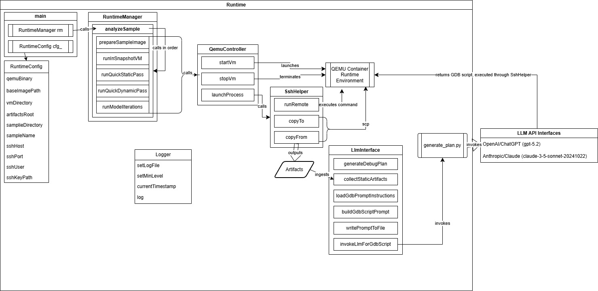
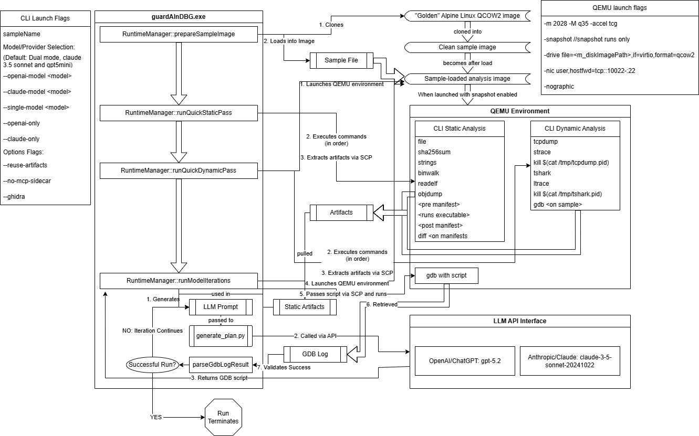

# guardAInDBG

> A research platform for evaluating OpenAI's ChatGPT and Anthropic's Claude in automated reverse engineering and dynamic malware analysis through an iterative feedback loop within a controlled execution environment.

## Project Status

Research prototype developed for M.S. Thesis evaluation. This repository represents the experimental implementation and is not intended as a production malware-analysis program.

## Overview

This project uses a QEMU-based virtualized environment running Alpine Linux to perform automated static and dynamic analysis on a series of capture-the-flag-style reverse engineering challenges that increase in complexity across successive levels. The system programmatically collects static-analysis artifacts using tools such as `binwalk`, `objdump`, and `strings`, then combines those artifacts with task-specific instructions to construct a prompt for the selected LLM. The model's response is constrained to a GDB script, which is executed against the challenge binary in an attempt to extract and validate the flag. Results from each attempt are then incorporated into subsequent prompts, creating an iterative feedback loop that allows the model to refine its analysis and debugging strategy.

This architecture provides a consistent experimental framework for evaluating how effectively each model can interpret reverse engineering artifacts, formulate debugging strategies, respond to unsuccessful attempts, and adapt its approach as challenge complexity increases.


## System Architecture

### Runtime Architecture



### Runtime Execution Flow



## Research 

### Research Objective

The primary research objective of this project was to evaluate the effectiveness of publicly available LLMs at increasingly complex reverse engineering tasks through iterative feedback and refinement.

### Experimental Design

The models were tested against a series of reverse engineering capture-the-flag-style challenges, each with a 39-character flag in the format `flag_{<random hexadecimal value>}`, with each level introducing additional reverse engineering complexity:

1. Simple plaintext string hardcoded into the program
2. The flag is generated on the stack at runtime
3. The flag is encrypted with a simple single-byte XOR, decrypted at runtime
4. The flag is encrypted with a stream cipher and is never decrypted; instead, the user's input is encrypted for comparison
5. The flag is encrypted with a more advanced cipher algorithm
6. The program introduces a simple SIGTRAP-based anti-debugging mechanism

Each model was tested against each level over 20 runs, each with a maximum of 10 iterations. Across the six challenge levels, 240 total analysis runs were conducted to evaluate success rate, convergence behavior, and performance as reverse engineering complexity increased.

### Results

Both models showed a clear decline in effectiveness as challenge difficulty increased, both in overall success rate and in the number of iterations required for successful runs. At Level 1, both models achieved a 100% success rate. By Level 6, Claude failed to complete any of the 20 runs successfully, while ChatGPT retained a 55% success rate. The results demonstrate that increasing reverse engineering complexity affected both models substantially, while also revealing significant differences in their robustness and ability to converge under more demanding analysis conditions.

### Publication

Schoolcraft, A., Payne, B. (2026). *An AI-Assisted Framework for Automated Malware Reverse Engineering and Analysis*. In: Arai, K. (eds) Proceedings of the Future Technologies Conference (FTC) 2026. October 13-14, 2026, Berlin, Germany. Lecture Notes in Networks and Systems (accepted, in press). Springer, Cham.

### Paper Abstract


> This paper presents an experimental framework for evaluating Large Language Model
> (LLM)-assisted reverse engineering and debugging within a controlled, iterative analysis environment.
> The system integrates lightweight static analysis tools, dynamic execution under GDB and
> QEMU, and LLM-guided reasoning into a bounded closed-loop workflow.
> 
> Evaluation was conducted using a six-level reverse engineering challenge dataset, with each
> level introducing increasing complexity, including runtime transformations and anti-debugging
> behavior. Two LLM systems were evaluated across 240 total runs using fixed prompts and iteration
> limits to ensure reproducibility.
> 
> Results show that LLMs perform effectively on lower-complexity tasks, achieving high
> success rates with minimal iterations. However, performance degrades significantly as complexity
> increases, particularly in scenarios involving multi-step reasoning and adversarial execution conditions.
> Comparative analysis reveals differences in model stability, convergence behavior, and
> robustness under constrained iterative conditions.
> 
> The study identifies key failure patterns, including iteration exhaustion, incorrect reasoning
> persistence, hallucinated actions, and partial solution convergence. These findings highlight both
> the potential and current limitations of LLM-guided debugging.
> 
> Overall, this work provides a structured methodology for evaluating LLM performance in
> binary analysis contexts and demonstrates that while LLMs are valuable assistive tools, further
> advancements are required for reliable application in complex reverse engineering workflows.

## Implementation

The framework is implemented primarily in C++, with Python used for communication with external LLM APIs. The C++ runtime is responsible for orchestration, virtualized execution, artifact collection, debugger interaction, and management of the iterative analysis workflow, while the Python integration layer handles model-specific API requests and responses.

The runtime is organized around several primary components:

- `RuntimeManager` — coordinates sample preparation, static and dynamic analysis, and the iterative LLM reasoning loop.
- `QemuController` — manages the isolated QEMU analysis environment.
- `TraceCollector` — collects runtime traces and analysis artifacts.
- `SshHelper` — manages command execution and artifact transfer between the host and analysis environment.
- `LlmInterface` — provides the interface between the runtime and supported LLM providers.
- `Logger` — records execution events and model interactions for later analysis.

For each analysis run, the target binary is loaded into an isolated Linux x86-64 QEMU environment. The framework first collects static artifacts using tools such as `strings`, `readelf`, and `objdump`, followed by dynamic analysis using GDB and runtime tracing utilities. Collected artifacts are returned to the host and incorporated into the context provided to the selected LLM.

The LLM then generates a GDB analysis strategy, which is executed against the target. Runtime results are returned to the model as feedback, allowing it to refine its approach iteratively:

```text
Target Binary
     ↓
Static Artifact Collection
     ↓
LLM Analysis / GDB Strategy
     ↓
QEMU + GDB Execution
     ↓
Runtime Artifacts
     ↓
LLM Feedback / Refinement
     ↺
```

Analysis continues until the target is successfully solved, a terminal failure occurs, or the configured iteration limit is reached. For the experiments reported in this research, each run was bounded to 10 iterations to provide a consistent and reproducible evaluation environment.

## Repository Structure

```tree
guardAInDBG
│   LICENSE
│   README.md
│
├───Code
│   └───Runtime
│       │     config.example.json
│       ├───include
│       │       LLMInterface.h
│       │       Logger.h
│       │       QEMUController.h
│       │       QemuMonitorClient.h
│       │       QmpClient.h
│       │       RuntimeConfig.h
│       │       RuntimeManager.h
│       │       SshHelper.h
│       │       TraceCollector.h
│       │
│       ├───prompts
│       │       instructions.txt
│       │
│       ├───scripts
│       │       generate_plan.py
│       │       requirements.txt
│       │
│       └───src
│               LLMInterface.cpp
│               Logger.cpp
│               main.cpp
│               QEMUController.cpp
│               QemuMonitorClient.cpp
│               QmpClient.cpp
│               RuntimeManager.cpp
│               SshHelper.cpp
│               TraceCollector.cpp
│
├───docs
│   │   arch.md
│   │   DEVELOPMENT.md
│   │   model_structure.md
│   │   roles.md
│   │   user_stories.md
│   │   use_cases.md
│   │
│   └───Diagrams
│       └───Runtime
│               components.md
│               data_models.md
│               dependencies.md
│               env_states.md
│               error_flow.md
│               runtime_api.md
│               runtime_arch.jpeg
│               runtime_execution_flow.jpeg
│               sequences.md
│               target_states.md
│
└───external
    └───nlohmann
            json.hpp
```

## Requirements

guardAInDBG was developed as a research prototype and requires a configured
virtualized analysis environment. The original experimental environment used
the following components:

### Host Environment

- Windows host system
- Visual Studio with C++ development tools / MSVC
- QEMU x86-64 system emulator
- Python 3
- OpenAI and/or Anthropic API credentials set as environment variables`OPENAI_API_KEY` and/or `ANTHROPIC_API_KEY`, respectively
- SSH/SCP access to the analysis VM

### Analysis Environment

- Alpine Linux x86-64 QCOW2 image
- GDB
- `file`
- `sha256sum`
- `strings`
- `binwalk`
- `readelf`
- `objdump`
- `tcpdump`
- `strace`
- `tshark`
- `ltrace`

### Research Dataset

The experiments described in the associated research used the six-level
Escalate reverse engineering challenge set. Challenge binaries and the
configured analysis VM are not distributed with this repository.

### LLM Integration

API credentials are required for the model provider being evaluated:

- OpenAI API key for OpenAI models
- Anthropic API key for Claude models

Provider credentials and other machine-specific configuration should be
supplied locally and are not included in the repository.

### Python Dependencies

The LLM integration layer requires Python 3 and the official OpenAI and
Anthropic Python SDKs:

```bash
pip install -r Code/Runtime/scripts/requirements.txt
```

## Usage

Copy `config.example.json` to `config.json` and update the local paths for QEMU, the analysis VM, and SSH key.

Once the host and analysis environment have been configured, and the `config.json` created, guardAInDBG can be executed from the command line against a target sample.

```bash
guardAInDBG.exe <sample executable>
  --openai-model <model> 
  --claude-model <model> 
  --single-model <model> 
  --openai-only
  --claude-only
  --reuse-artifacts
```

| Flag | Purpose |
|------|---------|
|  `<sample executable>` | Target binary to analyze |
| `--openai-model <model>` | Specifies the specific OpenAI model to use for analysis, defaults to gpt-5-mini |
| `--claude-model <model>` | Specifies the specific Anthropic model to use for analysis, defaults to claude-sonnet-3-5-20241022 |
| `--single-model <model>` | Uses only the one specific model, used in conjunction with `--openai-only` or `--claude-only` to specify model |
| `--openai-only` | Only use OpenAI API for LLM |
| `--claude-only` | Only use Anthropic API for LLM |
| `--reuse-artifacts` | Bypass initial static and dynamic passes, reusing artifacts from prior analysis sessions |

## License

Copyright © 2026 Alexander Schoolcraft.

This project is licensed under the Apache License 2.0. See the LICENSE file for details.
