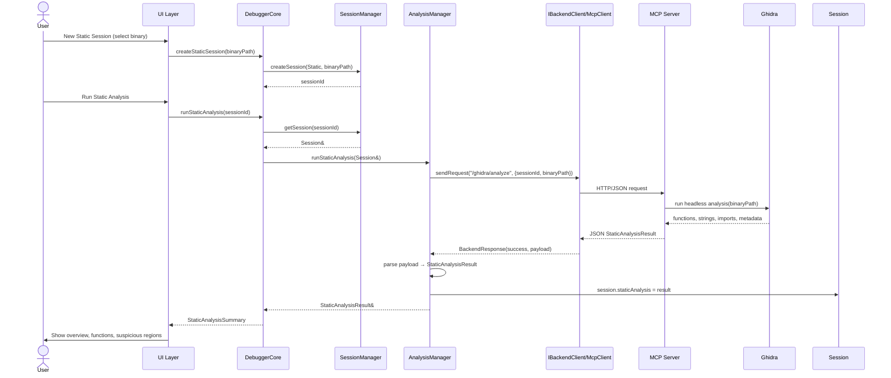
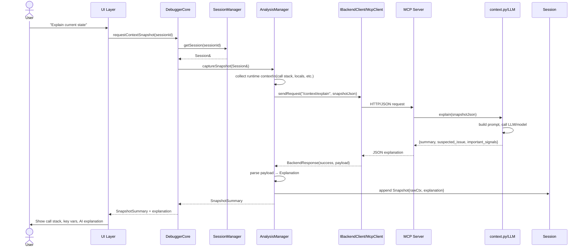
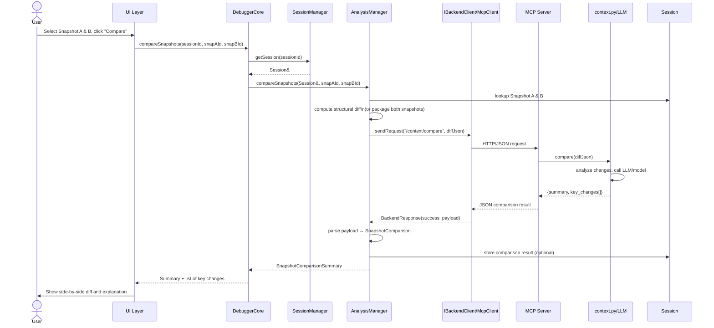
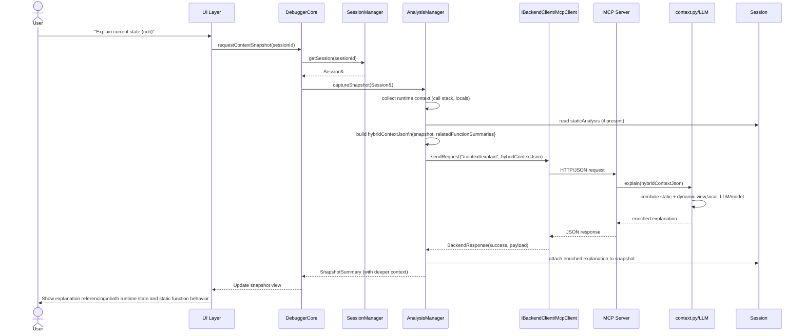

## Static Analysis Flow (runStaticAnalysis)

### ---------------------------------------------------------------------------

## Dynamic Snapshot and Explanation Flow (captureSnapshot & /context/explain)

### ---------------------------------------------------------------------------

## State Comparison Flow (compareSnapshots & /context/compare)

### ---------------------------------------------------------------------------

## Hybrid Flow: Dynamic Snapshot with Static Context

