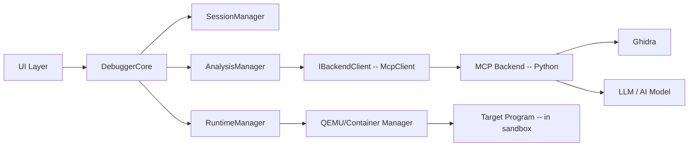

```mermaid
flowchart LR
    UI[UI Layer]
    DC[DebuggerCore]

    SM[SessionManager]
    AM[AnalysisManager]
    RM[RuntimeManager]

    BC[IBackendClient -- McpClient]
    MCP[MCP Backend -- Python]
    GH[Ghidra]
    LLM[LLM / AI Model]

    QEMU[QEMU/Container Manager]
    TARGET[Target Program -- in sandbox]

    UI --> DC

    DC --> SM
    DC --> AM
    DC --> RM

    AM --> BC
    BC --> MCP
    MCP --> GH
    MCP --> LLM

    RM --> QEMU
    QEMU --> TARGET

```