```mermaid
classDiagram
    %% Session domain
    class Session {
        +string id
        +SessionType type
        +SessionState state
        +path targetPath
        +StaticAnalysisResult staticAnalysis
        +vector~Snapshot~ snapshots
        +vector~BackendMessage~ backendLog
    }

    class SessionType {
        <<enumeration>>
        Static
        Dynamic
        Hybrid
    }

    class SessionState {
        <<enumeration>>
        New
        Configured
        StaticAnalyzing
        StaticReady
        DynamicRunning
        SnapshotAvailable
        Completed
        Error
        Closed
    }

    Session --> "1" StaticAnalysisResult : optional
    Session --> "0..*" Snapshot
    Session --> "0..*" BackendMessage

    %% Static analysis domain
    class StaticAnalysisResult {
        +string summary
        +vector~FunctionInfo~ functions
        +vector~StringInfo~ strings
        +vector~ImportInfo~ imports
        +vector~SuspiciousRegion~ suspiciousRegions
        +vector~string~ warnings
    }

    class FunctionInfo {
        +string id
        +string originalName
        +string currentName
        +uint64 address
        +uint32 sizeBytes
        +string summary
        +float suspiciousScore
        +bool renamed
    }

    class StringInfo {
        +string value
        +uint64 location
    }

    class ImportInfo {
        +string name
        +string library
    }

    class SuspiciousRegion {
        +string id
        +string description
        +SuspicionLevel severity
        +vector~string~ relatedFunctions
        +vector~string~ tags
    }

    class SuspicionLevel {
        <<enumeration>>
        Info
        Low
        Medium
        High
        Critical
    }

    StaticAnalysisResult --> "0..*" FunctionInfo
    StaticAnalysisResult --> "0..*" StringInfo
    StaticAnalysisResult --> "0..*" ImportInfo
    StaticAnalysisResult --> "0..*" SuspiciousRegion
    SuspiciousRegion --> SuspicionLevel

    %% Rename domain
    class RenameItem {
        +string targetId
        +RenameTargetKind kind
        +string oldName
        +string newName
        +string reason
    }

    class RenameTargetKind {
        <<enumeration>>
        Function
        GlobalLabel
        LocalVariable
    }

    RenameItem --> RenameTargetKind

    %% Snapshot / explanation domain
    class Snapshot {
        +string id
        +time_point timestamp
        +vector~StackFrame~ callStack
        +map~string,Value~ locals
        +vector~string~ notes
        +string rawContextJson
        +Explanation explanation
    }

    class StackFrame {
        +string functionName
        +string sourceLocation
        +uint64 instructionPointer
    }

    class Value {
        +string repr
    }

    class Explanation {
        +string summary
        +string suspectedIssue
        +vector~string~ importantSignals
        +string rawModelOutput
    }

    class SnapshotComparison {
        +string id
        +string snapshotAId
        +string snapshotBId
        +string summary
        +vector~StateChange~ keyChanges
        +string rawDiffJson
    }

    class StateChange {
        +string fieldPath
        +string beforeValue
        +string afterValue
        +string reason
    }

    Snapshot --> "0..*" StackFrame
    Snapshot --> "0..*" Value : locals
    Snapshot --> Explanation : optional
    Session --> "0..*" SnapshotComparison
    SnapshotComparison --> "0..*" StateChange

    %% Backend / logging domain
    class BackendResponse {
        +bool success
        +string endpoint
        +string payload
        +string errorMessage
    }

    class BackendMessage {
        +time_point timestamp
        +string endpoint
        +MessageDirection direction
        +string payload
        +BackendStatus status
    }

    class MessageDirection {
        <<enumeration>>
        Request
        Response
    }

    class BackendStatus {
        <<enumeration>>
        Ok
        Error
        Timeout
        Cancelled
    }

    BackendMessage --> MessageDirection
    BackendMessage --> BackendStatus
```

```cpp
struct FunctionInfo {
    std::string id;
    std::string originalName;
    std::string currentName;
    uint64_t    address;
    uint32_t    sizeBytes;
    std::string summary;
    float       suspiciousScore;
    bool        renamed;
};

enum class RenameTargetKind {
    Function,
    GlobalLabel,
    LocalVariable
};

struct RenameItem {
    std::string targetId;
    RenameTargetKind kind;
    std::string oldName;
    std::string newName;
    std::string reason;
};

enum class SessionState {
    New,
    Configured,
    StaticAnalyzing,
    StaticReady,
    DynamicRunning,
    SnapshotAvailable,
    Completed,
    Error,
    Closed
};
```