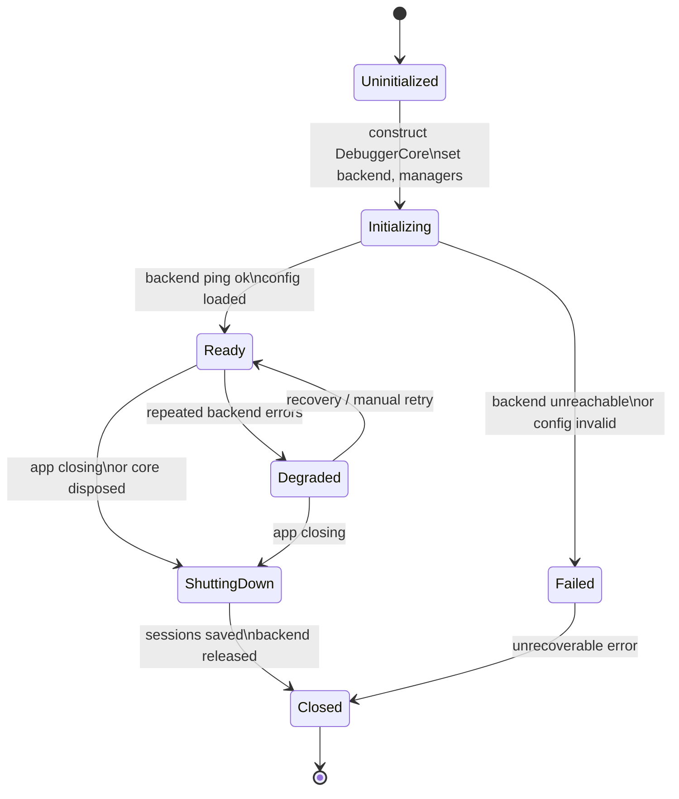

```mermaid
stateDiagram-v2
    [*] --> Uninitialized

    Uninitialized --> Initializing: construct DebuggerCore\nset backend, managers
    Initializing --> Ready: backend ping ok\nconfig loaded

    Initializing --> Failed: backend unreachable\nor config invalid

    Ready --> Degraded: repeated backend errors
    Degraded --> Ready: recovery / manual retry

    Ready --> ShuttingDown: app closing\nor core disposed
    Degraded --> ShuttingDown: app closing

    ShuttingDown --> Closed: sessions saved\nbackend released

    Failed --> Closed: unrecoverable error

    Closed --> [*]
```