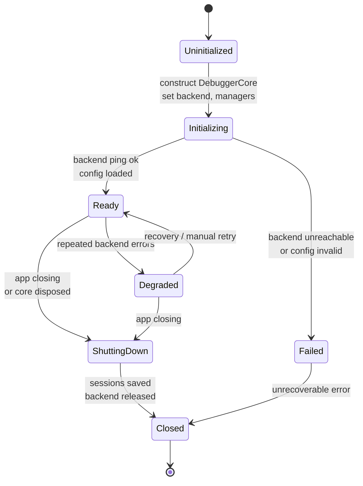

```mermaid
stateDiagram-v2
    [*] --> Uninitialized

    Uninitialized --> Initializing: construct DebuggerCore<br/>set backend, managers
    Initializing --> Ready: backend ping ok<br/>config loaded

    Initializing --> Failed: backend unreachable<br/>or config invalid

    Ready --> Degraded: repeated backend errors
    Degraded --> Ready: recovery / manual retry

    Ready --> ShuttingDown: app closing<br/>or core disposed
    Degraded --> ShuttingDown: app closing

    ShuttingDown --> Closed: sessions saved<br/>backend released

    Failed --> Closed: unrecoverable error

    Closed --> [*]
```