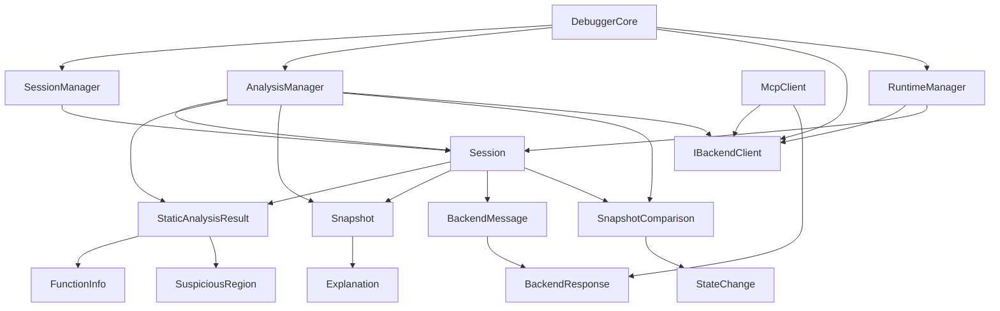

```mermaid
graph TD
    DC[DebuggerCore]
    SM[SessionManager]
    AM[AnalysisManager]
    SES[Session]
    SAR[StaticAnalysisResult]
    SNP[Snapshot]
    SCM[SnapshotComparison]
    BR[BackendResponse]
    BM[BackendMessage]
    IBC[IBackendClient]
    MCP[McpClient]
    FI[FunctionInfo]
    SR[SuspiciousRegion]
    EX[Explanation]
    SC[StateChange]
    RT[RuntimeManager]

    %% DebuggerCore dependencies
    DC --> SM
    DC --> AM
    DC --> IBC
    DC --> RT

    %% SessionManager dependencies
    SM --> SES

    %% AnalysisManager dependencies
    AM --> SES
    AM --> SAR
    AM --> SNP
    AM --> SCM
    AM --> IBC

    %% RuntimeManager dependencies
    RT --> IBC
    RT --> SES

    %% Backend client
    MCP --> IBC
    MCP --> BR

    %% Session aggregates
    SES --> SAR
    SES --> SNP
    SES --> BM
    SES --> SCM

    %% StaticAnalysisResult aggregates
    SAR --> FI
    SAR --> SR

    %% Snapshot aggregates
    SNP --> EX

    %% SnapshotComparison aggregates
    SCM --> SC

    %% BackendMessage depends on BackendResponse conceptually
    BM --> BR
```