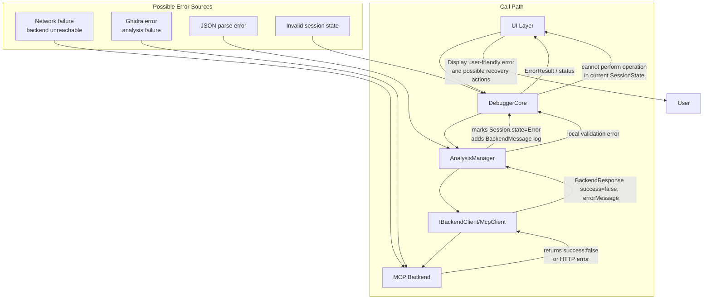

```mermaid
flowchart TD
    subgraph CallStack[Call Path]
        UI[UI Layer] --> DC[DebuggerCore] --> AM[AnalysisManager] --> IBC[IBackendClient/McpClient] --> MCP[MCP Backend]
    end

    subgraph ErrorSources[Possible Error Sources]
        ES1[Network failure \n backend unreachable]
        ES2[Ghidra error \n analysis failure]
        ES3[JSON parse error]
        ES4[Invalid session state]
    end

    ES1 --> MCP
    ES2 --> MCP
    ES3 --> AM
    ES4 --> DC

    MCP -->|returns success:false\nor HTTP error| IBC
    IBC -->|BackendResponse success=false, \n errorMessage| AM
    AM -->|marks Session.state=Error\nadds BackendMessage log | DC
    DC -->|ErrorResult / status| UI
    UI -->|Display user-friendly error\nand possible recovery actions| User

    %% Local core errors
    AM -->|local validation error| DC
    DC -->|cannot perform operation\nin current SessionState| UI
```