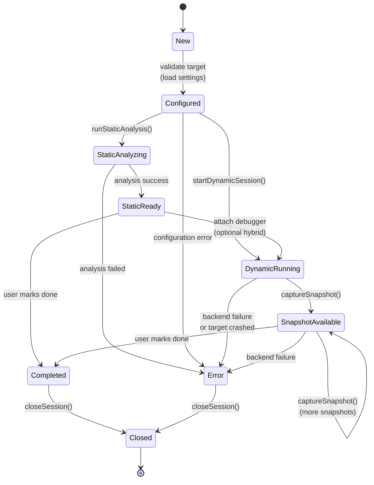
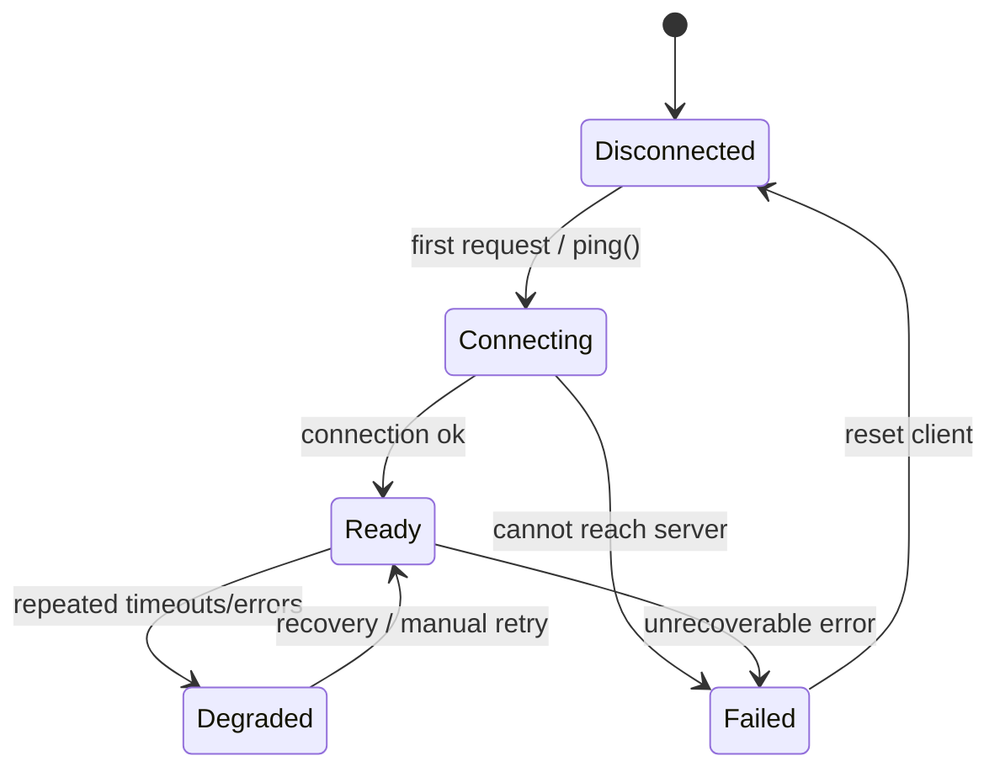

## Frontend Core Session State Diagram

```mermaid
stateDiagram-v2
    [*] --> New

    New --> Configured: validate target<br/>(load settings)
    Configured --> StaticAnalyzing: runStaticAnalysis()
    Configured --> DynamicRunning: startDynamicSession()

    StaticAnalyzing --> StaticReady: analysis success
    StaticAnalyzing --> Error: analysis failed

    StaticReady --> DynamicRunning: attach debugger<br/>(optional hybrid)
    StaticReady --> Completed: user marks done

    DynamicRunning --> SnapshotAvailable: captureSnapshot()
    SnapshotAvailable --> SnapshotAvailable: captureSnapshot()<br/>(more snapshots)
    SnapshotAvailable --> Completed: user marks done

    Configured --> Error: configuration error
    DynamicRunning --> Error: backend failure<br/>or target crashed
    SnapshotAvailable --> Error: backend failure

    Completed --> Closed: closeSession()
    Error --> Closed: closeSession()

    Closed --> [*]
```

## Backend Core Session State Diagram

```mermaid
stateDiagram-v2
    [*] --> Disconnected
    Disconnected --> Connecting: first request / ping()
    Connecting --> Ready: connection ok
    Connecting --> Failed: cannot reach server
    Ready --> Degraded: repeated timeouts/errors
    Degraded --> Ready: recovery / manual retry
    Ready --> Failed: unrecoverable error
    Failed --> Disconnected: reset client
```