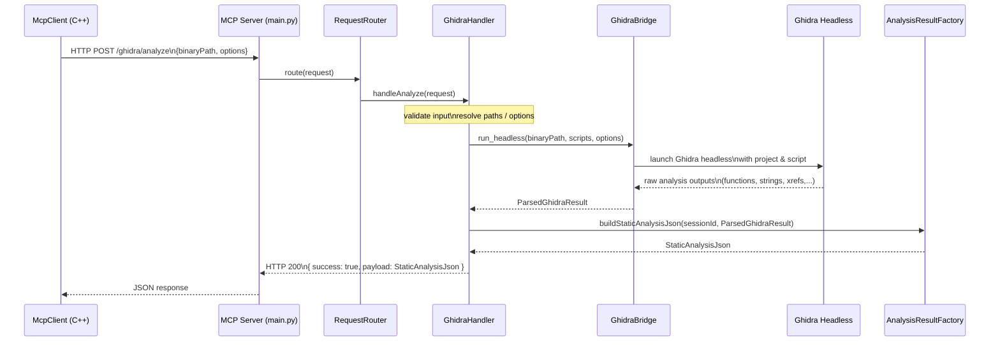

```mermaid
sequenceDiagram
    participant Core as McpClient (C++)
    participant MCP as MCP Server (main.py)
    participant RTR as RequestRouter
    participant GH as GhidraHandler
    participant GB as GhidraBridge
    participant GHIDRA as Ghidra Headless
    participant AR as AnalysisResultFactory

    Core->>MCP: HTTP POST /ghidra/analyze\n{binaryPath, options}
    MCP->>RTR: route(request)
    RTR->>GH: handleAnalyze(request)

    Note over GH: validate input\nresolve paths / options

    GH->>GB: run_headless(binaryPath, scripts, options)
    GB->>GHIDRA: launch Ghidra headless\nwith project & script
    GHIDRA-->>GB: raw analysis outputs\n(functions, strings, xrefs,...)
    GB-->>GH: ParsedGhidraResult

    GH->>AR: buildStaticAnalysisJson(sessionId, ParsedGhidraResult)
    AR-->>GH: StaticAnalysisJson

    GH-->>MCP: HTTP 200\n{ success: true, payload: StaticAnalysisJson }
    MCP-->>Core: JSON response
```