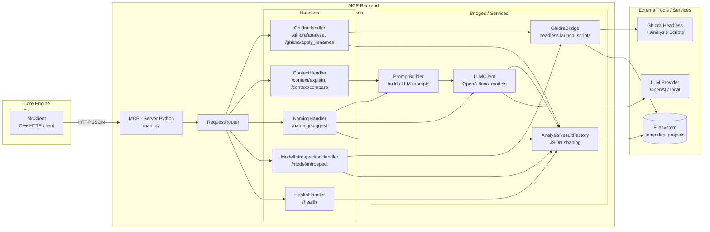

```mermaid
flowchart LR
    subgraph Core[Core Engine <br/>C++]
        MC[McClient<br/>C++ HTTP client]
    end

    MC -->|HTTP JSON| MCP[MCP - Server Python<br/>main.py]

    subgraph MCPSubsys[MCP Backend<br/>Python]
        direction LR

        MCP --> RTR[RequestRouter]

        subgraph Handlers[Handlers]
            GH[GhidraHandler\n/ghidra/analyze, /ghidra/apply_renames]
            CTX[ContextHandler\n/context/explain, /context/compare]
            NM[NamingHandler\n/naming/suggest]
            MI[ModelIntrospectionHandler\n/model/introspect]
            HL[HealthHandler\n/health]
        end

        RTR --> GH
        RTR --> CTX
        RTR --> NM
        RTR --> MI
        RTR --> HL

        subgraph Bridges[Bridges / Services]
            GB[GhidraBridge<br/>headless launch, scripts]
            PB[PromptBuilder<br/>builds LLM prompts]
            LC[LLMClient<br/>OpenAI/local models]
            AR[AnalysisResultFactory<br/>JSON shaping]
        end

        GH --> GB
        GH --> AR

        CTX --> PB
        PB --> LC
        LC --> AR

        NM --> PB
        NM --> LC
        NM --> AR

        MI --> GB
        MI --> AR

        HL --> AR
    end

    subgraph External[External Tools / Services]
        GHIDRA[Ghidra Headless\n+ Analysis Scripts]
        LLM[LLM Provider<br/>OpenAI / local]
        FS[(Filesystem<br/>temp dirs, projects)]
    end

    GB --> GHIDRA
    GB --> FS
    AR --> FS
    LC --> LLM
```