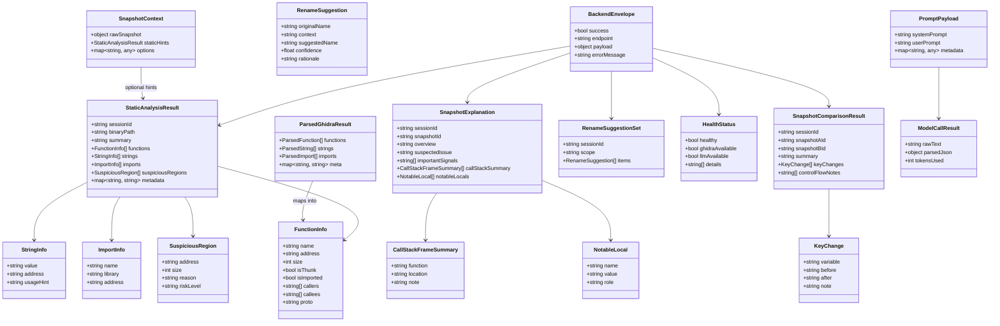

```mermaid
classDiagram
    %% Envelope
    class BackendEnvelope {
        +bool success
        +string endpoint
        +object payload
        +string errorMessage
    }

    %% Static analysis
    class StaticAnalysisResult {
        +string sessionId
        +string binaryPath
        +string summary
        +FunctionInfo[] functions
        +StringInfo[] strings
        +ImportInfo[] imports
        +SuspiciousRegion[] suspiciousRegions
        +map~string, string~ metadata
    }

    class FunctionInfo {
        +string name
        +string address
        +int size
        +bool isThunk
        +bool isImported
        +string[] callers
        +string[] callees
        +string proto
    }

    class StringInfo {
        +string value
        +string address
        +string usageHint
    }

    class ImportInfo {
        +string name
        +string library
        +string address
    }

    class SuspiciousRegion {
        +string address
        +int size
        +string reason
        +string riskLevel
    }

    %% Context explain
    class SnapshotExplanation {
        +string sessionId
        +string snapshotId
        +string overview
        +string suspectedIssue
        +string[] importantSignals
        +CallStackFrameSummary[] callStackSummary
        +NotableLocal[] notableLocals
    }

    class CallStackFrameSummary {
        +string function
        +string location
        +string note
    }

    class NotableLocal {
        +string name
        +string value
        +string role
    }

    %% Comparison
    class SnapshotComparisonResult {
        +string sessionId
        +string snapshotAId
        +string snapshotBId
        +string summary
        +KeyChange[] keyChanges
        +string[] controlFlowNotes
    }

    class KeyChange {
        +string variable
        +string before
        +string after
        +string note
    }

    %% Renaming
    class RenameSuggestionSet {
        +string sessionId
        +string scope
        +RenameSuggestion[] items
    }

    class RenameSuggestion {
        +string originalName
        +string context
        +string suggestedName
        +float confidence
        +string rationale
    }

    %% Health
    class HealthStatus {
        +bool healthy
        +bool ghidraAvailable
        +bool llmAvailable
        +string[] details
    }

    %% Internal Python models
    class ParsedGhidraResult {
        +ParsedFunction[] functions
        +ParsedString[] strings
        +ParsedImport[] imports
        +map~string, string~ meta
    }

    class SnapshotContext {
        +object rawSnapshot
        +StaticAnalysisResult staticHints
        +map~string, any~ options
    }

    class PromptPayload {
        +string systemPrompt
        +string userPrompt
        +map~string, any~ metadata
    }

    class ModelCallResult {
        +string rawText
        +object parsedJson
        +int tokensUsed
    }

    BackendEnvelope --> StaticAnalysisResult
    BackendEnvelope --> SnapshotExplanation
    BackendEnvelope --> SnapshotComparisonResult
    BackendEnvelope --> RenameSuggestionSet
    BackendEnvelope --> HealthStatus

    StaticAnalysisResult --> FunctionInfo
    StaticAnalysisResult --> StringInfo
    StaticAnalysisResult --> ImportInfo
    StaticAnalysisResult --> SuspiciousRegion

    SnapshotExplanation --> CallStackFrameSummary
    SnapshotExplanation --> NotableLocal

    SnapshotComparisonResult --> KeyChange

    ParsedGhidraResult --> FunctionInfo : maps into
    SnapshotContext --> StaticAnalysisResult : optional hints
    PromptPayload --> ModelCallResult
```