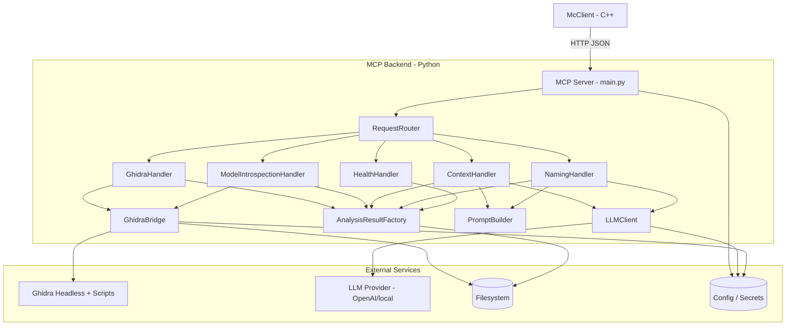

```mermaid
graph TD
    %% Entry
    MC[McClient - C++] -->|HTTP JSON| SRV[MCP Server - main.py]

    subgraph MCP[MCP Backend - Python]
        SRV --> RTR[RequestRouter]

        RTR --> GH[GhidraHandler]
        RTR --> CTX[ContextHandler]
        RTR --> NM[NamingHandler]
        RTR --> MI[ModelIntrospectionHandler]
        RTR --> HL[HealthHandler]

        GH --> GB[GhidraBridge]
        GH --> AR[AnalysisResultFactory]

        MI --> GB
        MI --> AR

        CTX --> PB[PromptBuilder]
        CTX --> LC[LLMClient]
        CTX --> AR

        NM --> PB
        NM --> LC
        NM --> AR

        HL --> AR
    end

    subgraph External[External Services]
        GHIDRA[Ghidra Headless + Scripts]
        LLM[LLM Provider - OpenAI/local]
        FS[(Filesystem)]
        CFG[(Config / Secrets)]
    end

    GB --> GHIDRA
    GB --> FS
    AR --> FS
    LC --> LLM

    SRV --> CFG
    LC --> CFG
    GB --> CFG
```