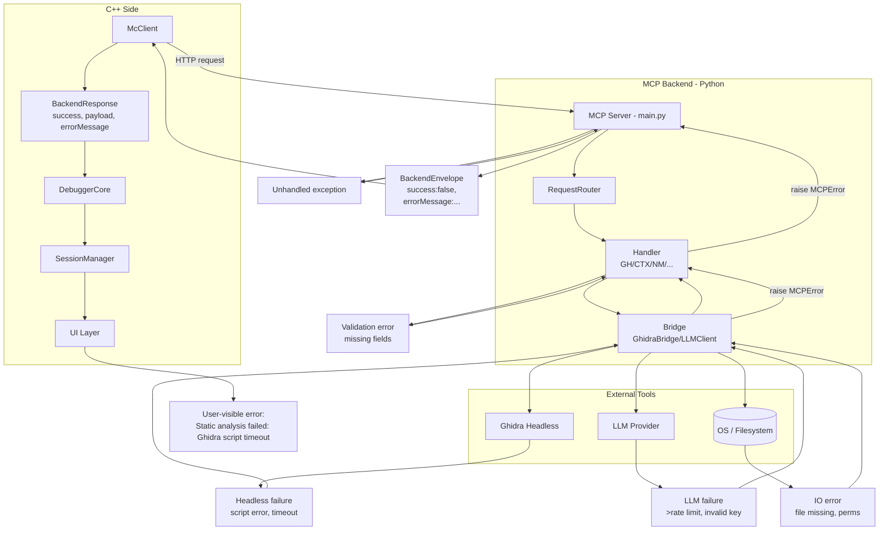

```mermaid
flowchart TD
    subgraph Core[C++ Side]
        MC[McClient]
        BE[BackendResponse<br/>success, payload, errorMessage]
        DC[DebuggerCore]
        SM[SessionManager]
        UI[UI Layer]
    end

    subgraph MCP[MCP Backend - Python]
        SRV[MCP Server - main.py]
        RTR[RequestRouter]
        HNDL[Handler <br/>GH/CTX/NM/...]
        BR[Bridge <br/>GhidraBridge/LLMClient]
    end

    subgraph External[External Tools]
        GHIDRA[Ghidra Headless]
        LLM[LLM Provider]
        OS[(OS / Filesystem)]
    end

    %% Normal call
    MC -->|HTTP request| SRV
    SRV --> RTR
    RTR --> HNDL
    HNDL --> BR
    BR --> GHIDRA
    BR --> LLM
    BR --> OS

    %% Error origins
    GHIDRA --> E1[Headless failure<br/>script error, timeout]
    LLM --> E2[LLM failure<br/>>rate limit, invalid key]
    OS --> E3[IO error<br/>file missing, perms]
    HNDL --> E4[Validation error<br/>missing fields]
    SRV --> E5[Unhandled exception]

    %% Error handling in MCP
    E1 --> BR
    E2 --> BR
    E3 --> BR
    BR --> HNDL

    E4 --> HNDL
    E5 --> SRV

    HNDL -->|raise MCPError| SRV
    BR -->|raise MCPError| HNDL

    SRV --> ENV[BackendEnvelope<br/>success:false,\nerrorMessage:...]

    ENV --> MC
    MC --> BE

    BE --> DC
    DC --> SM
    SM --> UI

    UI --> MSG[User-visible error:<br/>Static analysis failed: Ghidra script timeout]
```