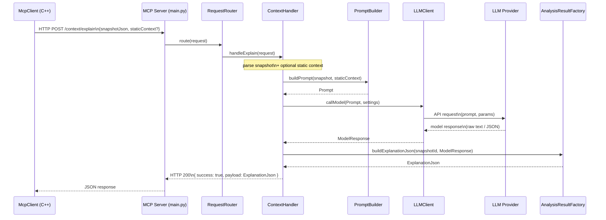

```mermaid
sequenceDiagram
    participant Core as McpClient (C++)
    participant MCP as MCP Server (main.py)
    participant RTR as RequestRouter
    participant CTX as ContextHandler
    participant PB as PromptBuilder
    participant LC as LLMClient
    participant LLM as LLM Provider
    participant AR as AnalysisResultFactory

    Core->>MCP: HTTP POST /context/explain\n{snapshotJson, staticContext?}
    MCP->>RTR: route(request)
    RTR->>CTX: handleExplain(request)

    Note over CTX: parse snapshot\n+ optional static context

    CTX->>PB: buildPrompt(snapshot, staticContext)
    PB-->>CTX: Prompt

    CTX->>LC: callModel(Prompt, settings)
    LC->>LLM: API request\n(prompt, params)
    LLM-->>LC: model response\n(raw text / JSON)
    LC-->>CTX: ModelResponse

    CTX->>AR: buildExplanationJson(snapshotId, ModelResponse)
    AR-->>CTX: ExplanationJson

    CTX-->>MCP: HTTP 200\n{ success: true, payload: ExplanationJson }
    MCP-->>Core: JSON response
```
