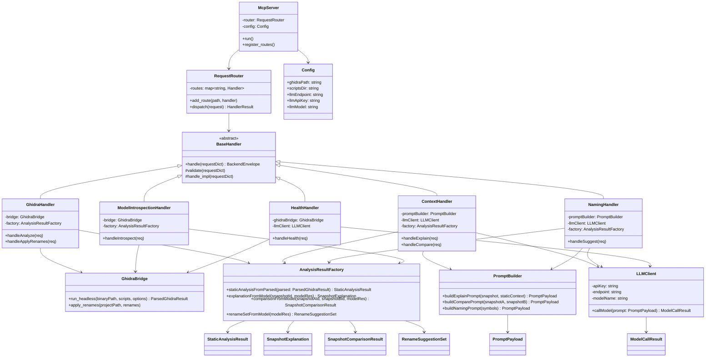

```mermaid
classDiagram
    class McpServer {
        +run()
        +register_routes()
        -router: RequestRouter
        -config: Config
    }

    class RequestRouter {
        +add_route(path, handler)
        +dispatch(request) HandlerResult
        -routes: map~string, Handler~
    }

    class BaseHandler {
        <<abstract>>
        +handle(requestDict) BackendEnvelope
        #validate(requestDict)
        #handle_impl(requestDict)
    }

    class GhidraHandler {
        +handleAnalyze(req)
        +handleApplyRenames(req)
        -bridge: GhidraBridge
        -factory: AnalysisResultFactory
    }

    class ContextHandler {
        +handleExplain(req)
        +handleCompare(req)
        -promptBuilder: PromptBuilder
        -llmClient: LLMClient
        -factory: AnalysisResultFactory
    }

    class NamingHandler {
        +handleSuggest(req)
        -promptBuilder: PromptBuilder
        -llmClient: LLMClient
        -factory: AnalysisResultFactory
    }

    class ModelIntrospectionHandler {
        +handleIntrospect(req)
        -bridge: GhidraBridge
        -factory: AnalysisResultFactory
    }

    class HealthHandler {
        +handleHealth(req)
        -ghidraBridge: GhidraBridge
        -llmClient: LLMClient
    }

    class GhidraBridge {
        +run_headless(binaryPath, scripts, options) ParsedGhidraResult
        +apply_renames(projectPath, renames)
    }

    class PromptBuilder {
        +buildExplainPrompt(snapshot, staticContext) PromptPayload
        +buildComparePrompt(snapshotA, snapshotB) PromptPayload
        +buildNamingPrompt(symbols) PromptPayload
    }

    class LLMClient {
        +callModel(prompt: PromptPayload) ModelCallResult
        -apiKey: string
        -endpoint: string
        -modelName: string
    }

    class AnalysisResultFactory {
        +staticAnalysisFromParsed(parsed: ParsedGhidraResult) StaticAnalysisResult
        +explanationFromModel(snapshotId, modelRes) SnapshotExplanation
        +comparisonFromModel(snapshotAId, snapshotBId, modelRes) SnapshotComparisonResult
        +renameSetFromModel(modelRes) RenameSuggestionSet
    }

    class Config {
        +ghidraPath: string
        +scriptsDir: string
        +llmEndpoint: string
        +llmApiKey: string
        +llmModel: string
    }

    McpServer --> RequestRouter
    McpServer --> Config

    RequestRouter --> BaseHandler
    BaseHandler <|-- GhidraHandler
    BaseHandler <|-- ContextHandler
    BaseHandler <|-- NamingHandler
    BaseHandler <|-- ModelIntrospectionHandler
    BaseHandler <|-- HealthHandler

    GhidraHandler --> GhidraBridge
    GhidraHandler --> AnalysisResultFactory

    ContextHandler --> PromptBuilder
    ContextHandler --> LLMClient
    ContextHandler --> AnalysisResultFactory

    NamingHandler --> PromptBuilder
    NamingHandler --> LLMClient
    NamingHandler --> AnalysisResultFactory

    ModelIntrospectionHandler --> GhidraBridge
    ModelIntrospectionHandler --> AnalysisResultFactory

    HealthHandler --> GhidraBridge
    HealthHandler --> LLMClient

    PromptBuilder --> PromptPayload
    LLMClient --> ModelCallResult
    AnalysisResultFactory --> StaticAnalysisResult
    AnalysisResultFactory --> SnapshotExplanation
    AnalysisResultFactory --> SnapshotComparisonResult
    AnalysisResultFactory --> RenameSuggestionSet
```