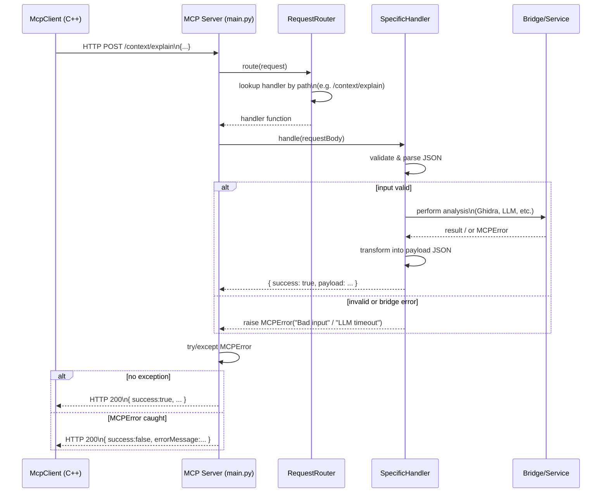

```mermaid
sequenceDiagram
    participant Core as McpClient (C++)
    participant SRV as MCP Server (main.py)
    participant RTR as RequestRouter
    participant HNDL as SpecificHandler
    participant BR as Bridge/Service

    Core->>SRV: HTTP POST /context/explain\n{...}
    SRV->>RTR: route(request)
    RTR->>RTR: lookup handler by path\n(e.g. /context/explain)
    RTR-->>SRV: handler function

    SRV->>HNDL: handle(requestBody)

    HNDL->>HNDL: validate & parse JSON
    alt input valid
        HNDL->>BR: perform analysis\n(Ghidra, LLM, etc.)
        BR-->>HNDL: result / or MCPError
        HNDL->>HNDL: transform into payload JSON
        HNDL-->>SRV: { success: true, payload: ... }
    else invalid or bridge error
        HNDL-->>SRV: raise MCPError("Bad input" / "LLM timeout")
    end

    SRV->>SRV: try/except MCPError
    alt no exception
        SRV-->>Core: HTTP 200\n{ success:true, ... }
    else MCPError caught
        SRV-->>Core: HTTP 200\n{ success:false, errorMessage:... }
    end
```