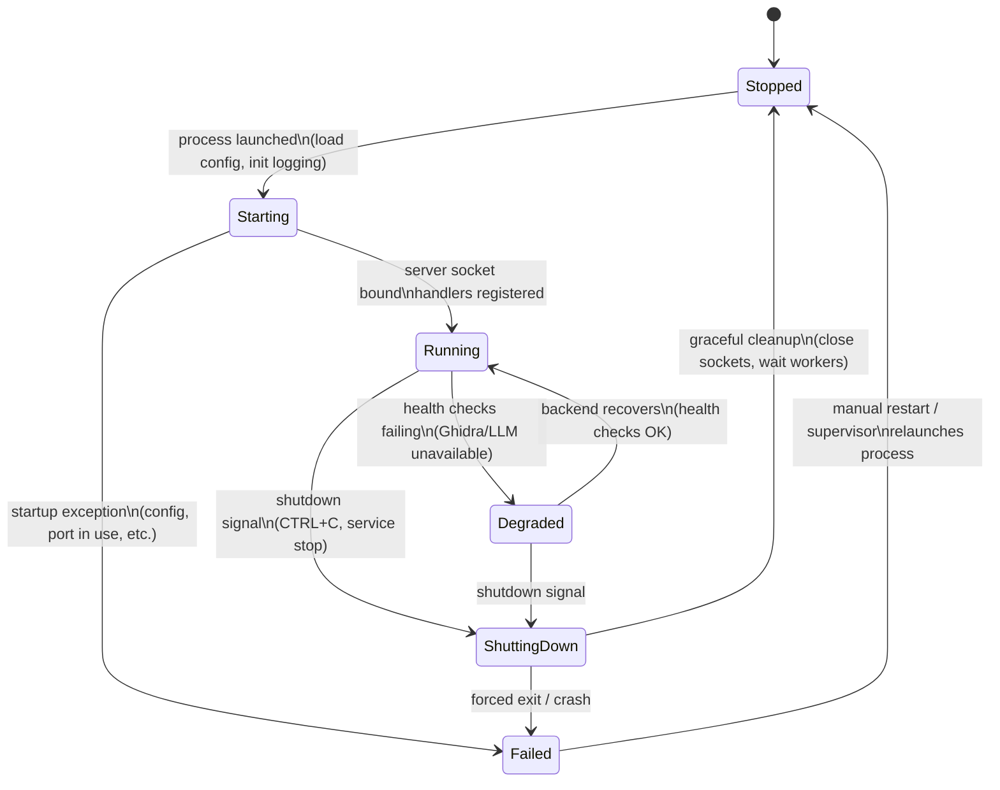

```mermaid
stateDiagram-v2
    [*] --> Stopped

    Stopped --> Starting: process launched\n(load config, init logging)
    Starting --> Running: server socket bound\nhandlers registered
    Starting --> Failed: startup exception\n(config, port in use, etc.)

    Running --> Degraded: health checks failing\n(Ghidra/LLM unavailable)
    Degraded --> Running: backend recovers\n(health checks OK)
    Running --> ShuttingDown: shutdown signal\n(CTRL+C, service stop)
    Degraded --> ShuttingDown: shutdown signal

    ShuttingDown --> Stopped: graceful cleanup\n(close sockets, wait workers)
    ShuttingDown --> Failed: forced exit / crash

    Failed --> Stopped: manual restart / supervisor\nrelaunches process
```