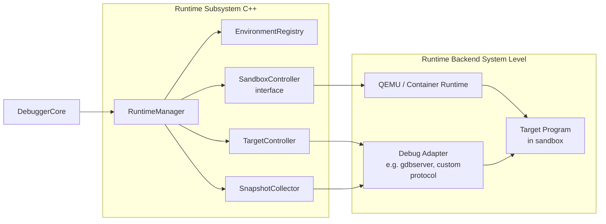

```mermaid
flowchart LR
    DC[DebuggerCore] --> RM[RuntimeManager]

    subgraph RuntimeSubsystem[Runtime Subsystem C++]
        RM --> ER[EnvironmentRegistry]
        RM --> SC[SandboxController<br/> interface]
        RM --> TC[TargetController]
        RM --> SNAP[SnapshotCollector]
    end

    subgraph SandboxBackend[Runtime Backend System Level]
        SC --> QEMU[QEMU / Container Runtime]
        TC --> DBG[Debug Adapter<br/> e.g. gdbserver, custom protocol]
        QEMU --> TARGET[Target Program<br/> in sandbox]
        DBG --> TARGET
        SNAP --> DBG
    end
```