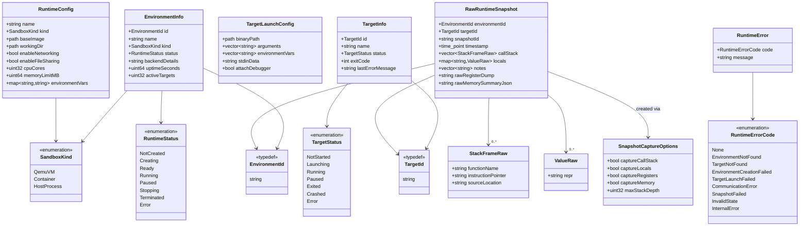

```mermaid
classDiagram
    %% Aliases
    class EnvironmentId {
        <<typedef>>
        string
    }

    class TargetId {
        <<typedef>>
        string
    }

    %% Environment domain
    class SandboxKind {
        <<enumeration>>
        QemuVM
        Container
        HostProcess
    }

    class RuntimeStatus {
        <<enumeration>>
        NotCreated
        Creating
        Ready
        Running
        Paused
        Stopping
        Terminated
        Error
    }

    class RuntimeConfig {
        +string name
        +SandboxKind kind
        +path baseImage
        +path workingDir
        +bool enableNetworking
        +bool enableFileSharing
        +uint32 cpuCores
        +uint64 memoryLimitMB
        +map~string,string~ environmentVars
    }

    class EnvironmentInfo {
        +EnvironmentId id
        +string name
        +SandboxKind kind
        +RuntimeStatus status
        +string backendDetails
        +uint64 uptimeSeconds
        +uint32 activeTargets
    }

    EnvironmentInfo --> EnvironmentId
    EnvironmentInfo --> SandboxKind
    EnvironmentInfo --> RuntimeStatus
    RuntimeConfig --> SandboxKind

    %% Target domain
    class TargetStatus {
        <<enumeration>>
        NotStarted
        Launching
        Running
        Paused
        Exited
        Crashed
        Error
    }

    class TargetLaunchConfig {
        +path binaryPath
        +vector~string~ arguments
        +vector~string~ environmentVars
        +string stdinData
        +bool attachDebugger
    }

    class TargetInfo {
        +TargetId id
        +string name
        +TargetStatus status
        +int exitCode
        +string lastErrorMessage
    }

    TargetInfo --> TargetId
    TargetInfo --> TargetStatus

    %% Snapshot domain
    class SnapshotCaptureOptions {
        +bool captureCallStack
        +bool captureLocals
        +bool captureRegisters
        +bool captureMemory
        +uint32 maxStackDepth
    }

    class StackFrameRaw {
        +string functionName
        +string instructionPointer
        +string sourceLocation
    }

    class ValueRaw {
        +string repr
    }

    class RawRuntimeSnapshot {
        +EnvironmentId environmentId
        +TargetId targetId
        +string snapshotId
        +time_point timestamp
        +vector~StackFrameRaw~ callStack
        +map~string,ValueRaw~ locals
        +vector~string~ notes
        +string rawRegisterDump
        +string rawMemorySummaryJson
    }

    RawRuntimeSnapshot --> EnvironmentId
    RawRuntimeSnapshot --> TargetId
    RawRuntimeSnapshot --> "0..*" StackFrameRaw
    RawRuntimeSnapshot --> "0..*" ValueRaw
    RawRuntimeSnapshot --> SnapshotCaptureOptions : created via

    %% Error domain
    class RuntimeErrorCode {
        <<enumeration>>
        None
        EnvironmentNotFound
        TargetNotFound
        EnvironmentCreationFailed
        TargetLaunchFailed
        CommunicationError
        SnapshotFailed
        InvalidState
        InternalError
    }

    class RuntimeError {
        +RuntimeErrorCode code
        +string message
    }

    RuntimeError --> RuntimeErrorCode
```