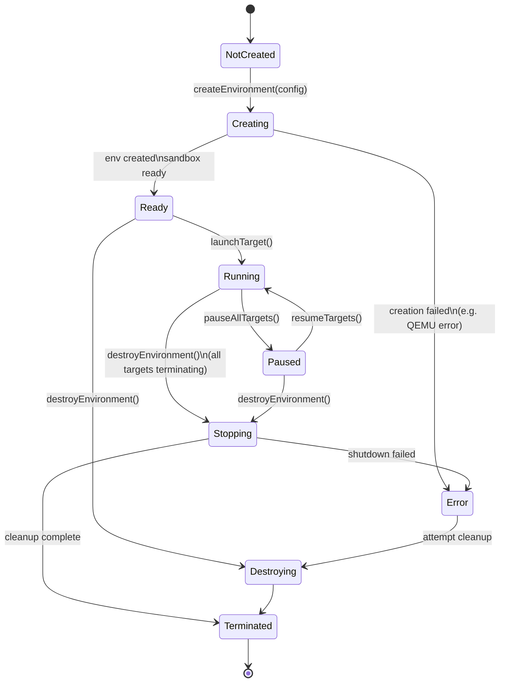

```mermaid
stateDiagram-v2
    [*] --> NotCreated

    NotCreated --> Creating: createEnvironment(config)
    Creating --> Ready: env created\nsandbox ready
    Creating --> Error: creation failed\n(e.g. QEMU error)

    Ready --> Running: launchTarget()
    Ready --> Destroying: destroyEnvironment()

    Running --> Paused: pauseAllTargets()
    Paused --> Running: resumeTargets()

    Running --> Stopping: destroyEnvironment()\n(all targets terminating)
    Paused --> Stopping: destroyEnvironment()

    Stopping --> Terminated: cleanup complete
    Stopping --> Error: shutdown failed

    Error --> Destroying: attempt cleanup
    Destroying --> Terminated

    Terminated --> [*]
```