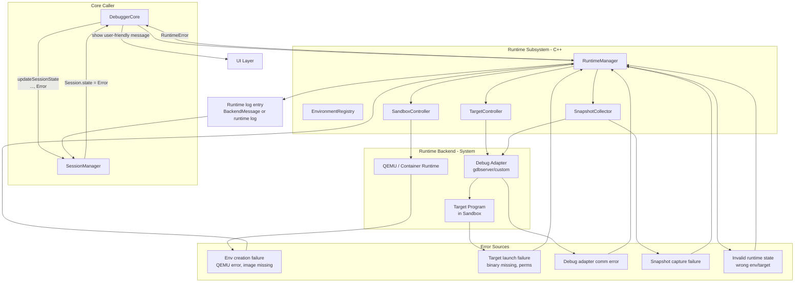

```mermaid
flowchart TD
    subgraph Caller[Core Caller]
        DC[DebuggerCore]
        SM[SessionManager]
    end

    subgraph RuntimeLayer[Runtime Subsystem - C++]
        RM[RuntimeManager]
        ER[EnvironmentRegistry]
        SC[SandboxController]
        TC[TargetController]
        SNAP[SnapshotCollector]
    end

    subgraph Backend[Runtime Backend - System]
        QEMU[QEMU / Container Runtime]
        DBG[Debug Adapter<br/>gdbserver/custom]
        TARGET[Target Program<br/>in Sandbox]
    end

    subgraph ErrorSources[Error Sources]
        E1[Env creation failure<br/>QEMU error, image missing]
        E2[Target launch failure<br/>binary missing, perms]
        E3[Debug adapter comm error]
        E4[Snapshot capture failure]
        E5[Invalid runtime state<br/>wrong env/target]
    end

    %% Normal call path
    DC --> RM
    RM --> SC
    RM --> TC
    RM --> SNAP

    SC --> QEMU
    TC --> DBG
    DBG --> TARGET
    SNAP --> DBG

    %% Errors originating in backend
    QEMU --> E1
    DBG --> E3
    TARGET --> E2

    %% Errors originating in runtime logic
    SNAP --> E4
    RM --> E5

    %% Error propagation back up
    E1 --> RM
    E2 --> RM
    E3 --> RM
    E4 --> RM
    E5 --> RM

    RM -->|RuntimeError| DC
    DC -->|updateSessionState <br/>..., Error| SM
    SM -->|Session.state = Error| DC
    DC -->|show user-friendly message| UI[UI Layer]

    %% Optional logging path
    RM --> LOG[Runtime log entry<br/>BackendMessage or runtime log]
    LOG --> SM
```