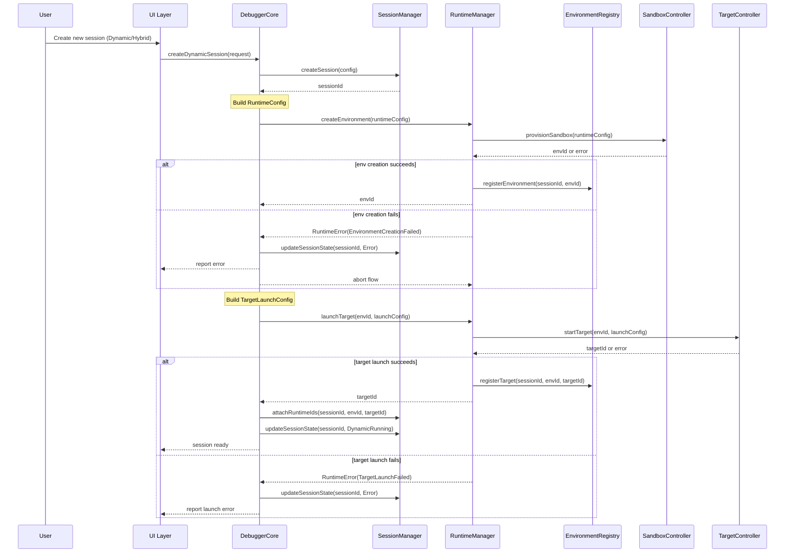
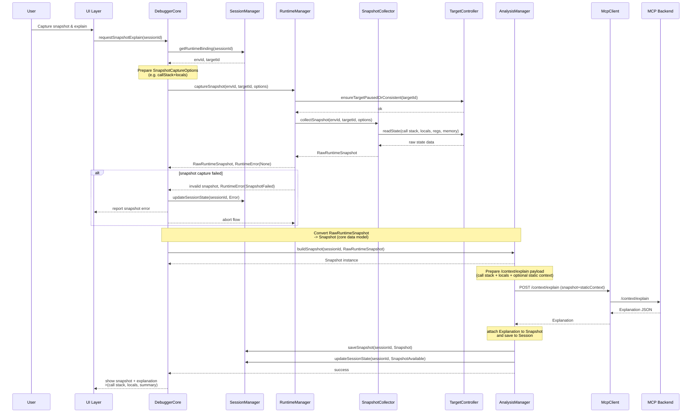
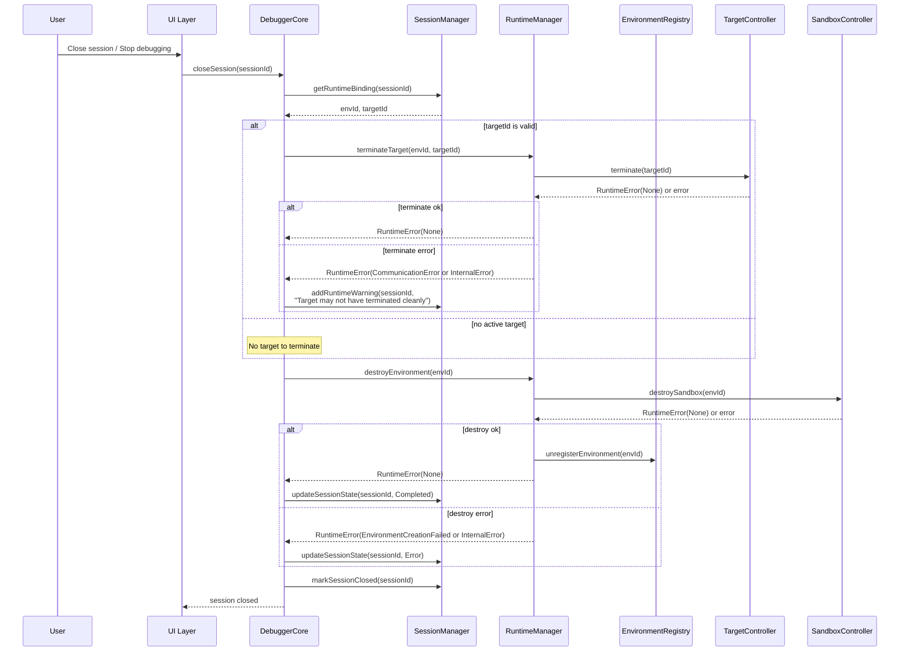

## 1️⃣ Dynamic Session Start: Create Environment + Launch Target

This covers:

* User creates a **dynamic** session
* Core creates a runtime environment
* Core launches target inside it
* Session gets wired to env/target

---

## 2️⃣ Snapshot Capture: Runtime → Core → MCP Explain

This one shows:

* User hits “Capture snapshot & explain”
* Core asks RuntimeManager for a **RawRuntimeSnapshot**
* AnalysisManager enriches it into a `Snapshot`
* Optional MCP `/context/explain` call
* Result attached to Session

---

## 3️⃣ Session Shutdown: Terminate Target & Destroy Environment

This covers:

* User closes a dynamic session
* Core terminates the target
* Core destroys environment
* Session transitions to `Completed` / `Closed`

