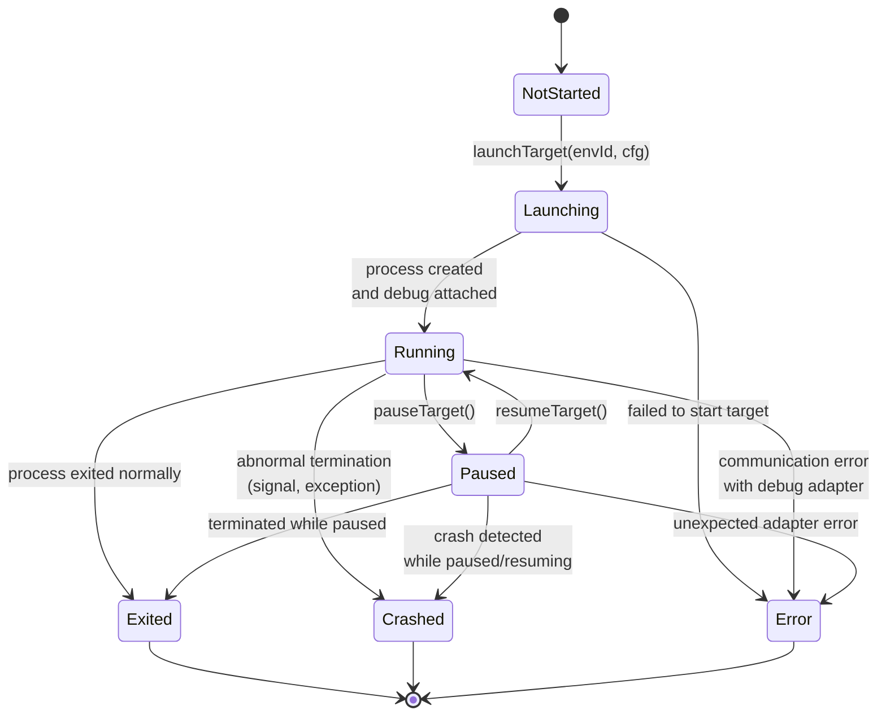

```mermaid
stateDiagram-v2
    [*] --> NotStarted

    NotStarted --> Launching: launchTarget(envId, cfg)
    Launching --> Running: process created<br/>and debug attached
    Launching --> Error: failed to start target

    Running --> Paused: pauseTarget()
    Paused --> Running: resumeTarget()

    Running --> Exited: process exited normally
    Running --> Crashed: abnormal termination<br/>(signal, exception)
    Paused --> Exited: terminated while paused
    Paused --> Crashed: crash detected<br/>while paused/resuming

    Running --> Error: communication error<br/>with debug adapter
    Paused --> Error: unexpected adapter error

    Exited --> [*]
    Crashed --> [*]
    Error --> [*]
```