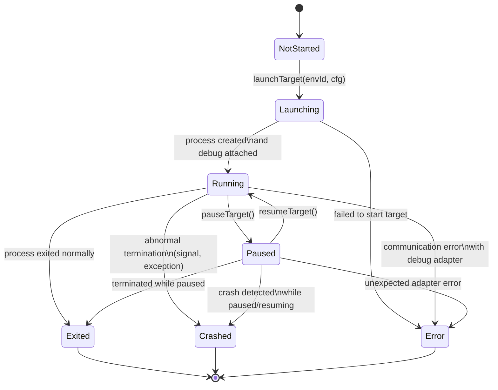

```mermaid
stateDiagram-v2
    [*] --> NotStarted

    NotStarted --> Launching: launchTarget(envId, cfg)
    Launching --> Running: process created\nand debug attached
    Launching --> Error: failed to start target

    Running --> Paused: pauseTarget()
    Paused --> Running: resumeTarget()

    Running --> Exited: process exited normally
    Running --> Crashed: abnormal termination\n(signal, exception)
    Paused --> Exited: terminated while paused
    Paused --> Crashed: crash detected\nwhile paused/resuming

    Running --> Error: communication error\nwith debug adapter
    Paused --> Error: unexpected adapter error

    Exited --> [*]
    Crashed --> [*]
    Error --> [*]
```