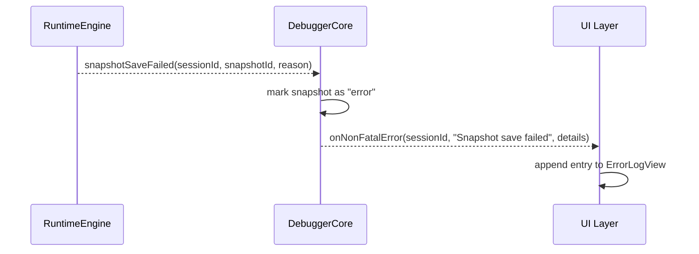
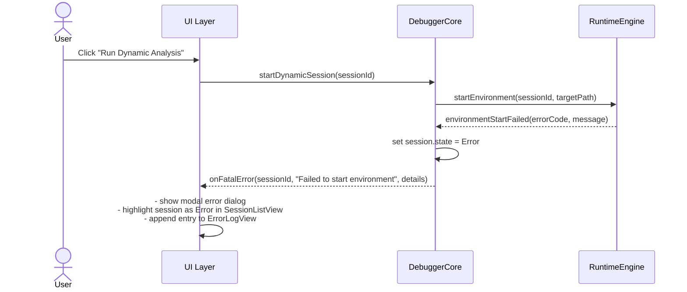

### Non-fatal Error Flow during Snapshot Capture

```mermaid
sequenceDiagram
    participant Runtime as RuntimeEngine
    participant Core as DebuggerCore
    participant UI as UI Layer

    Runtime-->>Core: snapshotSaveFailed(sessionId, snapshotId, reason)
    Core->>Core: mark snapshot as "error"
    Core-->>UI: onNonFatalError(sessionId, "Snapshot save failed", details)
    UI->>UI: append entry to ErrorLogView

```
---
### Diagram: UI Error Flow for Dynamic Analysis Session Start Failure (fatal)

```mermaid
sequenceDiagram
    actor User
    participant UI as UI Layer
    participant Core as DebuggerCore
    participant Runtime as RuntimeEngine

    User->>UI: Click "Run Dynamic Analysis"
    UI->>Core: startDynamicSession(sessionId)
    Core->>Runtime: startEnvironment(sessionId, targetPath)
    Runtime-->>Core: environmentStartFailed(errorCode, message)
    Core->>Core: set session.state = Error
    Core-->>UI: onFatalError(sessionId, "Failed to start environment", details)
    UI->>UI: - show modal error dialog <br/> - highlight session as Error in SessionListView <br/> - append entry to ErrorLogView
```