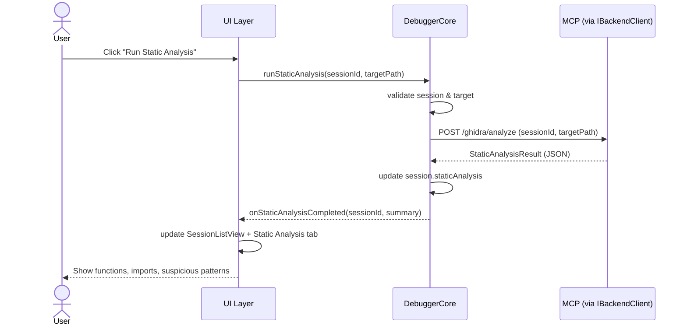

# UI ↔ CoreEngine Sequence Flows

This document captures key interaction flows between the UI and `DebuggerCore` using Mermaid sequence diagrams.

---

## 1. Run Static Analysis from UI

```mermaid
sequenceDiagram
    actor User
    participant UI as UI Layer
    participant Core as DebuggerCore
    participant MCP as MCP (via IBackendClient)

    User->>UI: Click "Run Static Analysis"
    UI->>Core: runStaticAnalysis(sessionId, targetPath)
    Core->>Core: validate session & target
    Core->>MCP: POST /ghidra/analyze (sessionId, targetPath)
    MCP-->>Core: StaticAnalysisResult (JSON)
    Core->>Core: update session.staticAnalysis
    Core-->>UI: onStaticAnalysisCompleted(sessionId, summary)
    UI->>UI: update SessionListView + Static Analysis tab
    UI-->>User: Show functions, imports, suspicious patterns
```