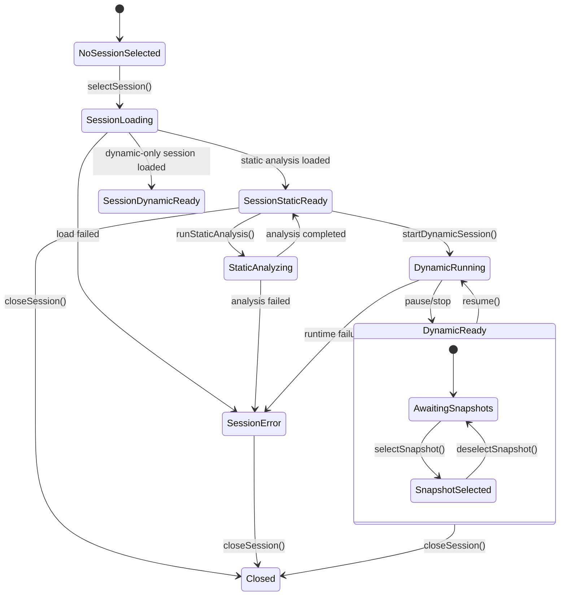
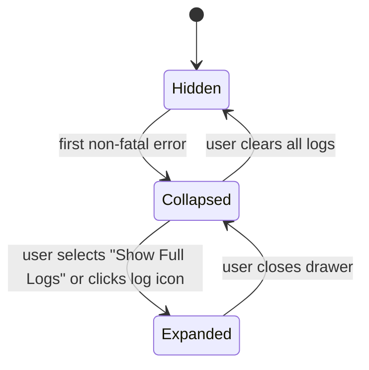

# UI State Models

This document describes high-level UI states for guardAInDBG and their relationship to session state.

---

## 1. Session View State Machine

The UI mirrors the CoreEngine's session state but adds a few UI-specific states for loading and busy indicators.

---
## 2. Error Log Visibility State

